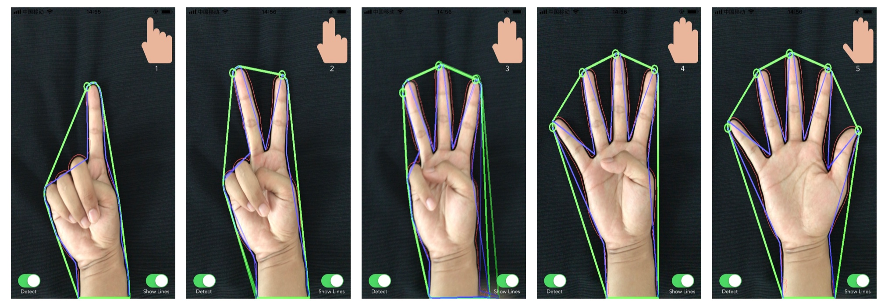

# FingertipDetection

An iOS Fingertip Detection Program in OpenCV.

### How do I get set up?

- Xcode
- opencv2.framework

This program works well in a dark background and is not good in a complex background. For more information please refer to my [blog](http://www.ningjia.wang/2016/11/14/iOS%20利用%20OpenCV%20实时识别手指/).

### Who do I talk to?

If you have any questions, you can contact the following person,

- Repo owner wjnmailg@gmail.com

### License

FingertipDetection is released under an MIT license. See LICENSE for details.

